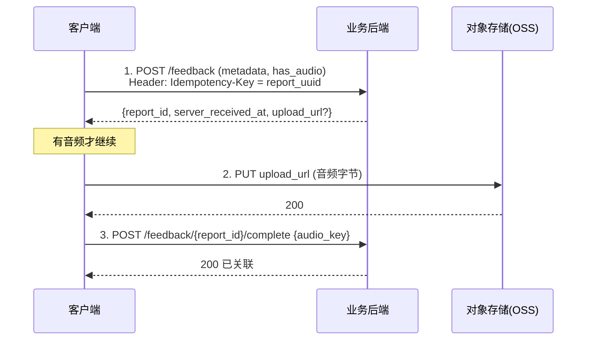

# 备注说明 · 课中报错反馈：原型实现 + 录音前后端工程建议

> 配套：[`PRD 课中报错反馈.md`](<PRD 课中报错反馈.md>)、[`UX Demo 课中报错反馈.html`](<UX Demo 课中报错反馈.html>)、[`Flutter Code 录音上传参考.dart`](<Flutter Code 录音上传参考.dart>)。
> 本文合并两部分：**Part A** 讲这份 HTML 原型「是怎么实现的」（供照着接真机）；**Part B** 讲录音怎么落地、前后端怎么可靠同步（工程执行层）。

---

# Part A · 原型实现说明

说明 [`UX Demo 课中报错反馈.html`](<UX Demo 课中报错反馈.html>) 这份交互原型的实现，供工程师照着接真机。原型是**单文件、零依赖、可离线打开**（图标内联 SVG symbol，不请求网络）。

## A1. 文件与运行

- **单个 HTML 文件**，双击用浏览器打开即可，无需服务器/构建。
- 右侧侧栏两个开关：`中文/EN`（语言）、`课中/课外`（场景）——纯前端切换，方便评审对照。
- 右侧「状态演示」面板：`动作名`（正常/超长/缺失）、`麦克风`（允许/拒绝）、`提交结果`（成功/离线/失败）、`报错入口`（正常/冷却中）——切到对应态后再走一遍流程，即可看到错误/空/阻断/极限状态的样子（截断、录音禁用、失败/离线 Toast、冷却拦截等）。

## A2. HTML 结构分区

```
.phone (iPhone 17: 402×874)
 └─ .screen
     ├─ .sb / .nav        状态栏 + 导航（时间、AI 模式）
     ├─ .vid              训练画面（SVG 占位，真机换视频流）
     ├─ .card             动作信息 + 报错入口(.rpill) + 记录本组(CTA)
     ├─ .dim              半透明遮罩
     ├─ #s1  一级 sheet    两个独立描框按钮 .optbtn（AI / 内容 / 课外+其他）
     ├─ #s2a 二级 sheet    AI 分支：.checks 多选 + .addbox 补充说明
     ├─ #s2c 二级 sheet    内容分支：结构同 s2a
     └─ #toast            提交成功提示
```

- **多选项** `.row.chk`：前置勾选框 `.cb`（选中 `.on` → 黑底白勾），行间无 hairline。
- **补充说明** `.addbox`：全局常驻（不由「其他」触发）。`.addhead`= 标签 + 字数计数 `.counter`；`.field`= `<textarea>`（内嵌麦克风 `.micbtn`）；`.recbar`= 录音态；`.clip`= 录完的语音条。

## A3. 状态与流程（JS，约 60 行）

纯原生 JS，无框架。核心函数：

| 函数 | 作用 |
|---|---|
| `open1()` | 点报错 → `reset()` + 显示遮罩与一级 sheet |
| `reset()` | 清空所有选择/文本/录音/计数，回到初始态 |
| `upd(sheet,cta)` | 按已选多选数切换主按钮文案（0→「直接提交」，≥1→「提交问题」） |
| `showToast(icon,titleKey,subKey)` | 显示 Toast，2.2s 后 `closeAll()` |
| `closeAll()` | 关闭所有浮层并 `reset()` |

**流转接线：**
- 一级 `.optbtn` 点击 → `jump` 跳转（Toast 占位）；`ai/content` → 显示对应二级 sheet。
- 二级 `.row.chk` 点击 → 切换 `.on` + `upd()` 更新按钮文案。
- 遮罩 `.dim` 点击：**仅一级** sheet 会关闭；二级不关闭（防丢输入），显式退出走「取消」/关闭。
- `.backbtn` 返回一级（并清理进行中的录音计时器）；`.cancel`/`.xclose` 直接 `closeAll()`。

## A4. i18n 机制

- 一个 `dict = { zh:{...}, en:{...} }` 字典，键值对应文案。
- 界面元素用 `data-i18n="key"` 标注；`applyLang()` 遍历赋值 `textContent`，并单独处理 `<textarea>` 的 `placeholder`、录音按钮文案、动态主按钮文案、动作名兜底。
- **切语言时已填内容保留**（只改文案，不重置表单）；Toast 显示中切语言会实时重译。
- 真机接入时，把 `dict` 换成项目的多语言资源即可，key 结构可直接复用。

## A5. 交互细节实现

- **文本框自适应**：`<textarea>` 监听 `input`，`height=auto` 再取 `scrollHeight`（封顶 112px 后内部滚动）；同时更新 `.counter`（`x/200`）。`maxlength=200` 硬限制。
- **底部安全区**：`.sheet` 底部预留 `padding-bottom` 模拟 home indicator 安全区；真机用 `env(safe-area-inset-bottom)`。
- **动作名兜底**：过长 → 截断省略号（CSS `text-overflow:ellipsis`）；获取不到 → 显示兜底文案「当前动作 / This exercise」。
- **录音（原型模拟）**：点麦克风 → 隐藏输入、显示 `.recbar` + 计时器（`setInterval`），到 60s 自动停；停止后生成 `.clip` 语音条（可删）；录完隐藏「不想打字…」提示行。**这是纯前端演示**，不含真实录音，真机实现见 Part B。
- **演示自适应**：手机随屏高分档缩放（`@media (max-height)`），笔记本单屏也能完整展示。

## A6. 真机需替换/补齐的部分

| 原型中 | 真机实现 |
|---|---|
| `.vid` 的 SVG 占位 | 替换为真实训练视频流；UI 与逻辑不动 |
| 录音的 `setInterval` 模拟 | 换成真实录音 + 本地存储 + 异步上传（见 **Part B**） |
| Toast 占位闭环 | 接真实提交（先本地入队再异步上传）+ 后端「已收到」消息 |
| 冷却间隔 / 冻结上下文 / 上下文快照 | 原型未含业务态，需按 PRD §3 在客户端实现 |
| 交互控件语义 | `<div>/<span>+onclick` 仅为原型；真机用语义化控件 + 焦点态 + ARIA |
| ASR | **后端**做（自动语种+转写），端上只上传音频（见 **Part B**） |

---

# Part B · 录音与前后端同步工程建议

聚焦**工程执行层**：录音怎么落地、前后端怎么可靠同步。给客户端与后端做接口/分工/节奏对齐用。

## B0. 三条总原则

1. **端上只录音，不转写**：ASR（自动语种识别 + 转写）在后端做，用户提交后零等待。
2. **先存后传**：提交 = 先写本地持久化队列 → 再异步上传；UI 永不被上传阻塞。
3. **全链路幂等 + 可续传**：客户端生成 `report_uuid` 贯穿始终，断网可续、失败可重试、**上传成功才删本地音频**。

## B1. 客户端录音实现

### 录制参数
| 项 | 取值 | 说明 |
|---|---|---|
| 格式 | AAC / `.m4a` | 通用、压缩率高 |
| 声道 / 采样 | 单声道 / 16kHz | 足够 ASR，体积小 |
| 码率 | 24–32 kbps | 60s ≈ **150–200KB**，弱网也稳 |
| 时长 | ≤60s 硬上限，自动停 | 到点即停并生成语音条 |
| 误触 | <0.8s 丢弃 | 手滑点一下不产生垃圾文件 |

### 权限
- 首次点麦克风 → 触发系统录音权限弹窗；**已授权**直接录，**拒绝**则录音入口禁用 +「麦克风权限已关闭，可去系统设置开启」。
- 缓存权限态，避免每次询问；进入表单前可预检权限决定 UI。

### 中断与健壮性（务必覆盖）
- 来电 / 切后台 / 拔耳机 / 锁屏 → **自动停并保存已录部分**，不丢。
- 磁盘不足 / 录制失败 → 明确提示，降级为纯文本。
- 文件命名 `{report_uuid}.m4a`，存 App 私有目录（沙盒），随队列项引用。

## B2. 先存后传：本地队列

### 队列项结构
```
{
  report_uuid,        // 幂等键（客户端 uuid v4）
  payload,            // 结构化字段，见 PRD §6（用户/设备/业务/标注）
  audio_path,         // 本地音频路径，可为空（纯文本反馈）
  state,              // pending | uploading | uploaded | failed
  retry_count,
  created_at          // 客户端时间，仅参考；权威时间以服务端为准
}
```

### 状态机
```
提交 → [pending] → [uploading] ──成功──→ [uploaded] → 删除本地音频、出队
                        └────失败──→ [failed] → 指数退避重试
```

### 持久化与续传时机
- 用 **Hive / Isar / SQLite** 持久化，App 被杀也不丢。
- **触发续传**：① 提交后立即；② 网络恢复（监听连通性）；③ App 冷启动扫描 `pending`/`failed`；④ 定时兜底。
- 退避策略：指数退避 + 随机抖动（如 2/4/8/…s，封顶 + jitter），避免恢复瞬间惊群。

## B3. 前后端同步契约（API）

### 推荐方案：两步 + 预签名直传
**理由**：音频不经过业务服务器（直传对象存储 OSS/S3），元数据与音频解耦、可扩展、单点失败面小。



- **去重**：`Idempotency-Key = report_uuid`；重复提交返回**同一** `report_id`，不产生重复工单。
- **上传 URL**：由后端签发预签名 PUT（限时、限大小、限类型）。
- **闭环**：步骤 1 返回 `server_received_at`，端上据此展示「已收到」并出队。

### 简化替代（MVP 可选）
因音频文件很小（<200KB），可用**单个 multipart** `POST /feedback`（metadata + 音频一起传）。
- 优点：一次请求、实现简单。缺点：音频走业务服务器、失败要整体重传、服务器承压。
- 建议：**P0 用它快速跑通闭环，P1 切到预签名直传。**

### 请求/响应示例
```jsonc
// POST /feedback
{
  "report_uuid": "b1e2…",           // 幂等键
  "action_id": "squat_001",
  "course_id": "c_123",
  "level1": "ai",                    // ai | content
  "level2": ["over_count","pose"],   // 多选，可空
  "text": "第3个没计上",             // ≤200 字，可空
  "has_audio": true,
  "audio_duration_ms": 5200,
  "context": { /* 设备/网络/模型版本/组次/AI计数… 见 PRD §6 */ }
}
// → 200
{ "report_id": 90887, "server_received_at": "2026-07-16T09:00:00Z",
  "upload_url": "https://oss…/put?sig=…", "audio_key": "feedback/90887/audio.m4a" }
```

## B4. 后端处理管线（与录音相关）

1. 收 metadata → 校验 → 落库（`report` 表，绑 `report_uuid` 去重）。
2. 收音频（OSS 直传 + `complete` 接口关联，或 OSS 事件回调）→ 挂到 `report_id`。
3. **异步 ASR**（消息队列 + worker，不内联）：自动语种识别 + 转写 → 回写 `transcript / lang / confidence`。
4. ASR 失败 → 保留音频、标 `asr_failed`、可重试/人工，**不阻塞**工单生成（文本+上下文已足够建单）。
5. 之后：去重聚合 → 工单/看板/Bug 机器人 → 状态回推用户（见 PRD §7）。

## B5. 同步边界与可靠性

| 场景 | 处理 |
|---|---|
| 元数据成功、音频失败 | 仅重传音频；后端允许「先有 report 后补音频」，设补传超时（如 24h 未补标 `audio_missing`） |
| 音频成功、`complete` 失败 | `complete` 幂等重试即可（音频已在 OSS） |
| 重复提交 / 网络重试 | `report_uuid` 幂等去重，返回同一 `report_id` |
| 断网 | 本地队列堆积，联网批量补传（退避 + 抖动） |
| 弱网 / 大文件 | 音频小可不分片；若未来放宽时长，再上分片/断点续传 |
| 时钟偏差 | **服务端时间为准**，客户端时间仅作参考字段 |
| 隐私合规 | 传输 TLS + OSS 加密存储 + 访问权限最小化 + 采集同意 + 存储期限（见 PRD §6 警示），需隐私/法务确认 |

## B6. 分工与落地节奏

**客户端（Flutter）**：录音模块、权限流、本地持久化队列、续传/退避、上传态与 UI 反馈。参考 [`Flutter Code 录音上传参考.dart`](<Flutter Code 录音上传参考.dart>)。
**后端**：`/feedback` 系列接口、预签名签发、OSS 接入、ASR 异步管线、去重聚合、工单/看板/Bug 机器人、状态回推。

**契约先行**：前后端先一起把 **API + payload schema（基于 PRD §6）** 定死，再并行开发，避免联调返工。

| 阶段 | 范围 |
|---|---|
| **P0** | 文本反馈 + 音频单请求上传 + 基础幂等去重 → 先跑通端到端闭环 |
| **P1** | 预签名直传 + 本地队列续传 + 后端 ASR + 「已修复」状态回推 |
| **P2** | 分片/断点续传（若放宽时长）、聚合看板 & Bug 机器人阈值优化 |

## B7. 可观测性（上线必带）

- **埋点**：上传成功率、平均重试次数、断网补传量、ASR 失败率、端到端（提交→入库）时延。
- **告警**：上传成功率跌破阈值、ASR 队列积压、`audio_missing` 比例异常。
- 这些指标同时反哺 PRD §1 的「可复现率」与「闭环时长」两个成功衡量。
