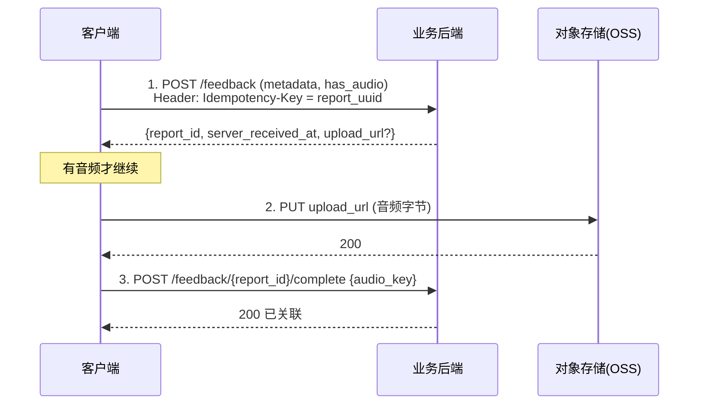

# 备注说明 · 用户录音实现与前后端同步工程建议

> 配套文档：[`PRD 课中报错反馈.md`](<PRD 课中报错反馈.md>)、[`UX Demo 课中报错反馈.html`](<UX Demo 课中报错反馈.html>)、[`Flutter Code 录音上传参考.dart`](<Flutter Code 录音上传参考.dart>)。
> 本文聚焦**工程执行层**：录音怎么落地、前后端怎么可靠同步。给客户端与后端做接口/分工/节奏对齐用。

## 0. 三条总原则

1. **端上只录音，不转写**：ASR（自动语种识别 + 转写）在后端做，用户提交后零等待。
2. **先存后传**：提交 = 先写本地持久化队列 → 再异步上传；UI 永不被上传阻塞。
3. **全链路幂等 + 可续传**：客户端生成 `report_uuid` 贯穿始终，断网可续、失败可重试、**上传成功才删本地音频**。

---

## 1. 客户端录音实现

### 1.1 录制参数
| 项 | 取值 | 说明 |
|---|---|---|
| 格式 | AAC / `.m4a` | 通用、压缩率高 |
| 声道 / 采样 | 单声道 / 16kHz | 足够 ASR，体积小 |
| 码率 | 24–32 kbps | 60s ≈ **150–200KB**，弱网也稳 |
| 时长 | ≤60s 硬上限，自动停 | 到点即停并生成语音条 |
| 误触 | <0.8s 丢弃 | 手滑点一下不产生垃圾文件 |

### 1.2 权限
- 首次点麦克风 → 触发系统录音权限弹窗；**已授权**直接录，**拒绝**则录音入口禁用 +「麦克风权限已关闭，可去系统设置开启」。
- 缓存权限态，避免每次询问；进入表单前可预检权限决定 UI。

### 1.3 中断与健壮性（务必覆盖）
- 来电 / 切后台 / 拔耳机 / 锁屏 → **自动停并保存已录部分**，不丢。
- 磁盘不足 / 录制失败 → 明确提示，降级为纯文本。
- 文件命名 `{report_uuid}.m4a`，存 App 私有目录（沙盒），随队列项引用。

---

## 2. 先存后传：本地队列

### 2.1 队列项结构
```
{
  report_uuid,        // 幂等键（客户端 uuid v4）
  payload,            // 结构化字段，见 PRD §6（用户/设备/业务/标注）
  audio_path,         // 本地音频路径，可为空（纯文本反馈）
  state,              // pending | uploading | uploaded | failed
  retry_count,
  created_at          // 客户端时间，仅参考；权威时间以服务端为准
}
```

### 2.2 状态机
```
提交 → [pending] → [uploading] ──成功──→ [uploaded] → 删除本地音频、出队
                        └────失败──→ [failed] → 指数退避重试
```

### 2.3 持久化与续传时机
- 用 **Hive / Isar / SQLite** 持久化，App 被杀也不丢。
- **触发续传**：① 提交后立即；② 网络恢复（监听连通性）；③ App 冷启动扫描 `pending`/`failed`；④ 定时兜底。
- 退避策略：指数退避 + 随机抖动（如 2/4/8/…s，封顶 + jitter），避免恢复瞬间惊群。

---

## 3. 前后端同步契约（API）

### 3.1 推荐方案：两步 + 预签名直传
**理由**：音频不经过业务服务器（直传对象存储 OSS/S3），元数据与音频解耦、可扩展、单点失败面小。



- **去重**：`Idempotency-Key = report_uuid`；重复提交返回**同一** `report_id`，不产生重复工单。
- **上传 URL**：由后端签发预签名 PUT（限时、限大小、限类型）。
- **闭环**：步骤 1 返回 `server_received_at`，端上据此展示「已收到」并出队。

### 3.2 简化替代（MVP 可选）
因音频文件很小（<200KB），可用**单个 multipart** `POST /feedback`（metadata + 音频一起传）。
- 优点：一次请求、实现简单。
- 缺点：音频走业务服务器、失败要整体重传、服务器承压。
- 建议：**P0 用它快速跑通闭环，P1 切到预签名直传。**

### 3.3 请求/响应示例
```jsonc
// POST /feedback
{
  "report_uuid": "b1e2…",           // 幂等键
  "action_id": "squat_001",
  "course_id": "c_123",
  "level1": "ai",                    // ai | content
  "level2": ["over_count","pose"],   // 多选，可空
  "text": "第3个没计上",             // ≤200 字，可空
  "has_audio": true,
  "audio_duration_ms": 5200,
  "context": { /* 设备/网络/模型版本/组次/AI计数… 见 PRD §6 */ }
}
// → 200
{ "report_id": 90887, "server_received_at": "2026-07-16T09:00:00Z",
  "upload_url": "https://oss…/put?sig=…", "audio_key": "feedback/90887/audio.m4a" }
```

---

## 4. 后端处理管线（与录音相关）

1. 收 metadata → 校验 → 落库（`report` 表，绑 `report_uuid` 去重）。
2. 收音频（OSS 直传 + `complete` 接口关联，或 OSS 事件回调）→ 挂到 `report_id`。
3. **异步 ASR**（消息队列 + worker，不内联）：自动语种识别 + 转写 → 回写 `transcript / lang / confidence`。
4. ASR 失败 → 保留音频、标 `asr_failed`、可重试/人工，**不阻塞**工单生成（文本+上下文已足够建单）。
5. 之后：去重聚合 → 工单/看板/Bug 机器人 → 状态回推用户（见 PRD §7）。

---

## 5. 同步边界与可靠性

| 场景 | 处理 |
|---|---|
| 元数据成功、音频失败 | 仅重传音频；后端允许「先有 report 后补音频」，设补传超时（如 24h 未补标 `audio_missing`） |
| 音频成功、`complete` 失败 | `complete` 幂等重试即可（音频已在 OSS） |
| 重复提交 / 网络重试 | `report_uuid` 幂等去重，返回同一 `report_id` |
| 断网 | 本地队列堆积，联网批量补传（退避 + 抖动） |
| 弱网 / 大文件 | 音频小可不分片；若未来放宽时长，再上分片/断点续传 |
| 时钟偏差 | **服务端时间为准**，客户端时间仅作参考字段 |
| 隐私合规 | 传输 TLS + OSS 加密存储 + 访问权限最小化 + 采集同意 + 存储期限（见 PRD §6 警示），需隐私/法务确认 |

---

## 6. 分工与落地节奏

**客户端（Flutter）**：录音模块、权限流、本地持久化队列、续传/退避、上传态与 UI 反馈。参考 [`Flutter Code 录音上传参考.dart`](<Flutter Code 录音上传参考.dart>)。
**后端**：`/feedback` 系列接口、预签名签发、OSS 接入、ASR 异步管线、去重聚合、工单/看板/Bug 机器人、状态回推。

**契约先行**：前后端先一起把 **API + payload schema（基于 PRD §6）** 定死，再并行开发，避免联调返工。

| 阶段 | 范围 |
|---|---|
| **P0** | 文本反馈 + 音频单请求上传 + 基础幂等去重 → 先跑通端到端闭环 |
| **P1** | 预签名直传 + 本地队列续传 + 后端 ASR + 「已修复」状态回推 |
| **P2** | 分片/断点续传（若放宽时长）、聚合看板 & Bug 机器人阈值优化 |

---

## 7. 可观测性（上线必带）

- **埋点**：上传成功率、平均重试次数、断网补传量、ASR 失败率、端到端（提交→入库）时延。
- **告警**：上传成功率跌破阈值、ASR 队列积压、`audio_missing` 比例异常。
- 这些指标同时反哺 PRD §1 的「可复现率」与「闭环时长」两个成功衡量。
