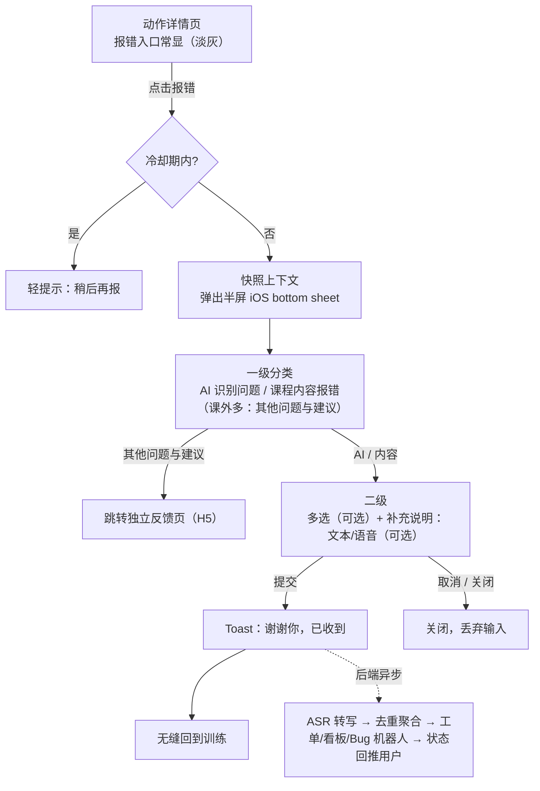

# 课中报错反馈 · PRD

> 版本：v1（原型阶段）｜负责人：产品｜关联原型：[`UX-Demo_One_button_report.html`](<UX-Demo_One_button_report.html>)｜实现说明：[`课中报错 实现说明.md`](<课中报错 实现说明.md>)

## 1. 背景与目标

课中用户遇到 AI 识别 / 计数不准、或课件内容有误时，缺少「就地、低成本」的反馈通道，问题难以被结构化收集与复现。

**目标：** 在动作详情页提供一个**门槛极低、就地触发**的报错入口，把用户反馈 + 现场上下文结构化上报，供 AI 团队与课程研发团队排查修复。

**成功衡量：** 有效反馈量、可复现率（带上下文/视频的比例）、从上报到修复的闭环时长。

## 2. 适用范围

| 场景 | 一级选项 |
|---|---|
| **课中**（上课状态） | AI 识别问题、课程内容报错（**2 项**） |
| **课外**（非上课的动作详情页） | 额外增加「其他问题与建议」→ 跳独立反馈页（**3 项**） |

## 3. 交互逻辑

**关键规则：**

1. **两个入口**：动作详情页常驻淡灰「报错」pill，以及右上 ⋮ 菜单内同款「报错」项，点击后走**同一流程**；不置灰、不做「已报错」态；同节课允许多次上报，但设**提交冷却间隔**防手滑刷屏。
2. **点击即快照**：点报错的**那一刻**即快照上下文（见 §6），后续填多久都不影响现场数据。
3. **不暂停训练**：填表时火柴人可见、训练不暂停；仅**冻结上报上下文**（挡自动推进/跳下一动作）。（P1 可选：填表时暂停 AI 识别规则，防误计。）
4. **一级必选、二级可选**：点一级任一项直接进二级；二级多选与补充说明**均可选**，caption 明示「可多选；不选也能直接提交」。
5. **补充说明全局常驻**：二级底部固定「其他问题或补充说明」，文本（≤200 字）+ 语音（≤60s）任选，不用先选「其他」。
6. **语音只录音、后端转写**：端上仅录音存文件，ASR（自动语种识别+转写）在后端做，用户零等待。
7. **防丢输入**：点浮层外**不关闭**；显式退出用左下角「取消」或右上角关闭。
8. **提交即闭环**：Toast 感谢即回训练；后端另发「已收到」消息，并在修复后回推用户。
9. **动作名兜底**：动作名过长 → 截断省略号；获取不到 → 该行不展示（标题「这个动作哪里不对？」仍表意）。

## 4. 交互设计图（屏）

完整可交互版见 [`UX-Demo_One_button_report.html`](<UX-Demo_One_button_report.html>)（支持 中/英、课中/课外 切换）。核心 4 屏：

1. **动作详情页** — 右下「报错」淡灰 pill ＋ 右上 ⋮ 菜单同款入口；底部主 CTA「记录本组」。
2. **一级分类（半屏 sheet）** — 标题「动作名 / 这个动作哪里不对？」；两个独立描框按钮：AI 识别问题、课程内容报错（课外 +其他问题与建议 ↗）。
3. **二级（半屏 sheet）** — 前置勾选框多选（无分隔线）；caption「可多选；不选也能直接提交」；底部常驻「其他问题或补充说明」文本框（内嵌麦克风，超两行自动增高，右上计数 x/200）；录音态显示计时 + 「60 秒内」；左下「取消」右侧「直接提交/提交问题」胶囊按钮；底部留安全区。
4. **提交 Toast** — 「谢谢你，已收到！」闪现后回训练。

**规范：** iPhone 17（402×874pt）｜字号 20/17/16/13/12｜全胶囊按钮｜iOS bottom sheet 样式｜中英双版切换。

## 5. 文案（中英对照）

| 键 | 中文 | English |
|---|---|---|
| 一级·标题 | 这个动作哪里不对？ | What's off with this exercise? |
| 一级·选项1 | AI 识别问题 | AI detection issue |
| 一级·选项2 | 课程内容报错 | Course content issue |
| 一级·选项3(课外) | 其他问题与建议 | Other & suggestions |
| 二级·AI 标题 | AI 哪里识别不准？ | Where's the AI off? |
| 二级·caption | 可多选；不选也能直接提交 | Pick any — or just submit |
| AI 选项 | 计数多了 / 计数少了 / 身体识别不准 / AI 讲解不清楚 | Counted a rep I didn't do / Missed a rep I did / Body tracking is off / Coaching was unclear |
| 内容选项 | 示范图·视频不对 / 动作名称不对 / 训练部位标注不对 / 动作讲解不对 | Demo image or video looks off / Exercise name doesn't match / Target muscle looks off / Description isn't accurate |
| 补充说明·标签 | 其他问题或补充说明 | Other issue or details |
| 补充说明·占位 | 说说这个动作的具体问题… | Tell us what happened… |
| 录音提示 | 不想打字？点麦克风直接说（60 秒内） | Rather talk? Tap the mic (up to 60s) |
| 主按钮 | 直接提交 / 提交问题 | Submit anyway / Submit |
| Toast | 谢谢你，已收到！／ 你的反馈会帮 ATOM 把这个动作做得更准 | Thanks — got it! / Your note helps ATOM read this exercise better |

## 6. 数据抓取（点报错瞬间）

| 层 | 字段（节选） | 来源 |
|---|---|---|
| 用户/设备 | 用户ID、设备ID、手机型号、系统/App版本、网络类型与信号 | 前端 |
| 业务 | 时间戳、课程ID/名称、动作ID/名称、课件版本、当前组次/目标reps/AI已计数 | 前端+后端 |
| 视频/AI运行时 | 触发点前后 N 秒视频clip、关键点时序、姿态/计数模型版本、置信度 | 前端上传 |
| 用户标注 | 一级分类、二级多选、文本(≤200字)、语音(≤60s)、语音时长 | 前端 |
| 后端衍生 | ASR转写文本、识别语种、置信度、聚合hash、严重度、路由团队、工单状态 | 后端 |

> ⚠️ 视频/语音涉及用户影像与声音 → 采集同意 + 存储期限 + 访问权限，需隐私/法务确认。

## 7. 后端处理（简）

数据入后端后：**校验入库 → 语音跑 ASR（自动语种+转写）→ 按 `动作ID+问题类型+模型版本` 去重聚合 → 生成/更新工单同步至 AI 团队 & 课程研发看板 + 按阈值推 Bug 机器人 → 工单状态机（受理/排查/已修复）→「已修复」回推用户**。核心：同类问题聚成一张卡按量排序，不逐条轰炸团队。

## 8. 状态设计（错误 / 空 / 阻断 / 极限）

各状态在 [`UX-Demo_One_button_report.html`](<UX-Demo_One_button_report.html>) 底部「状态演示」面板可切换预览。

**错误状态**
- 提交 / 上传失败 → 保留本地、静默重试，不丢
- 麦克风权限被拒 → 录音入口禁用 ＋「麦克风权限已关闭，可去系统设置开启」
- 视频 clip 抓取失败 → 降级为仅表单，不阻塞
- 跳转独立反馈页失败 / 登录态失效 → 兜底提示

**空状态**
- 不选不填也能提交（一级 + 上下文已足够），按钮「直接提交」
- 动作名获取不到 → 该行不展示（标题仍表意）
- 补充说明为空 → 正常（选填）
- 「我的反馈」无记录 → 空列表引导

**阻断状态**
- 冷却期内再次报错 → 轻提示「稍后再报」
- 提交中 → 按钮 loading，防重复提交（幂等）
- 录音 / 录像未授权 → 挡住相关能力，先引导授权（首次触发系统权限弹窗）
- 填表期间冻结上下文、挡自动推进；点浮层外不关闭，防丢输入

**极限状态**
- 动作名 / 课程名超长 → 截断省略号
- 文本 ≤200 字（到顶禁止输入）＋ 实时计数；多行自动增高、封顶内滚
- 语音 ≤60s 自动停；<0.8s 判误触丢弃
- 离线队列积压 → 联网批量补传（指数退避）

## 9. 交付物

- **(a) 可交互 HTML**：[`UX-Demo_One_button_report.html`](<UX-Demo_One_button_report.html>)（中英双版 + 课中/课外，可离线打开，底部含状态演示）。
- **(b) 实现说明（Markdown）**：[`课中报错 实现说明.md`](<课中报错 实现说明.md>)。
- **(附) 录音+离线上传 Flutter 参考代码**：[`report_recording_reference.dart`](report_recording_reference.dart)。
